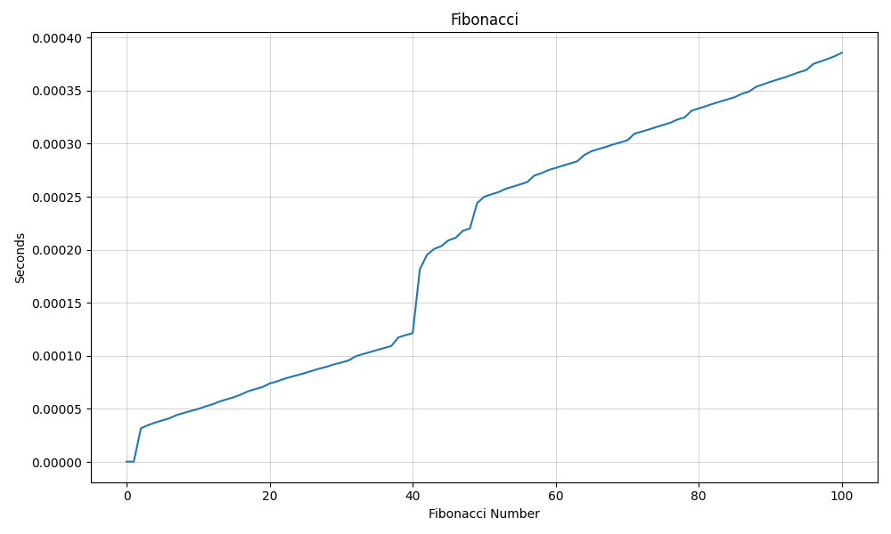

# pythonRefresher
Assignment 1 for Topics in CS This is my code for the echo part of the assignment. The code takes a user input and 'echoes' it back. The 'echo' function contains a for loop that iterates through the input text from the end 3 times. The loop creates a new line with \n from 3 characters, 2, to 1.  This is my code for the Fibonacci Sequence. the code starts with a timer function that counts the time the program takes to execute each term of the sequence. The "fib" function is the Fibonacci formula. The sorted_points variable stores a list pairing the time taken to execute, with the number in the sequence. The remaining code creates the plot for the numbers and the time it took to execute. Resulting graph.